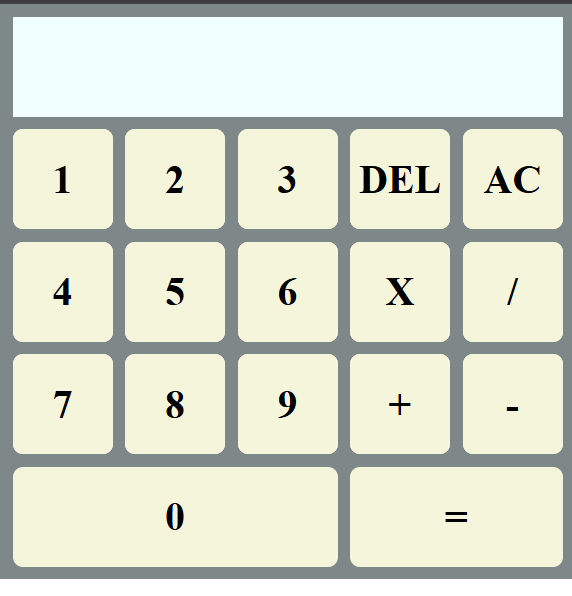
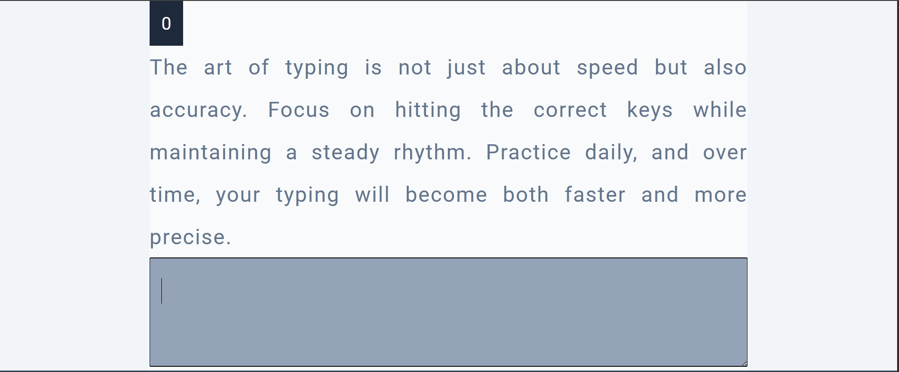
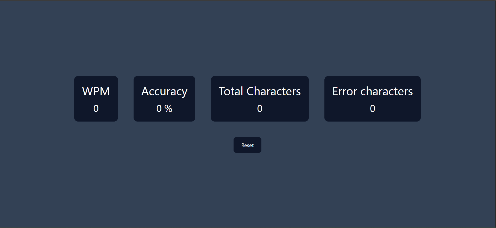

# ⚛️ ReactProjects 🚀 | Fun, Fast & Functional UI Components

> ✨ A growing collection of cool mini React apps built to sharpen React + UI skills.  
> Learn. Build. Ship. Repeat. 🚀

[](https://reactjs.org/)
[](https://github.com/pragyan-ghimire/ReactProjects/stargazers)

---

## 📂 Projects Included

---

### 🖩 Calculator

A fully functional calculator app built with React.  
A great exercise in component composition and state management!

**✨ Features:**
- Basic arithmetic operations ➕ ➖ ✖️ ➗
- **AC** button → clear all
- **DEL** button → delete last digit
- Responsive layout
- Clean button grid design



---

### ⌨️ Typing Test App

A beautiful typing test app to practice your typing speed and accuracy.  
Focus on **accuracy first, then speed**!

**✨ Features:**
- Dynamic paragraph to type
- Live **WPM (Words Per Minute)** counter
- Real-time **accuracy** calculation
- Simple & clean UI
- Great for daily typing practice!




---

## 🚀 Getting Started

### Prerequisites

- [Node.js](https://nodejs.org/) (v16+ recommended)
- npm

### Installation & Running

1️⃣ Clone this repository:

```bash
git clone https://github.com/your-username/ReactProjects.git
cd ReactProjects

2️⃣ Navigate to a project folder:

    ```bash
    cd Calculator
    ```

3️⃣ Install dependencies:

    ```bash
    npm install
    ```

4️⃣ Start the project:

    ```bash
    npm run dev
    ```

---

✨ Keep on learning! ✨
